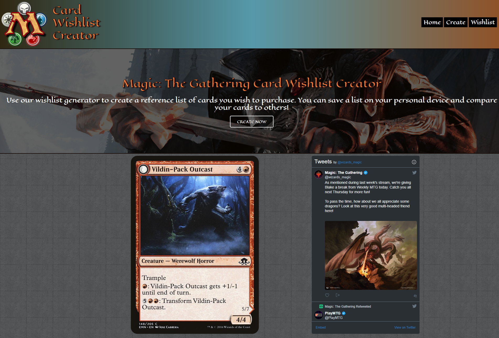

# magic-app

## User Story

 

AS A Magic the Gathering player
I WANT a platflorm that will allow me to build a card deck
SO THAT I plan out my purchases and strategize my games

# Acceptance Criteria

GIVEN a Magic the Gathering search platform
 

<ul>
<li>WHEN I search for a card</li>
<li>THEN I am presented with the cards picture and information about the card</li>
<li>WHEN I find the card I searched for</li>
<li>THEN I am presented with an option to add the card to my wishlist or search for a different card</li>
<li>WHEN I save the card to my wishlist</li>
<li>THEN I can see it is stored locally on my computer and appears on the right of the page with other saved cards
<li>WHEN I click on the wishlist tab</li>
<li>THEN I am presented with all of my saved cards (image and information) that I am able to scroll through</li>
</ul>

[Deployed Site](placeholder)

Home Page for our Website

